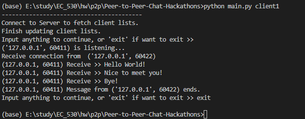
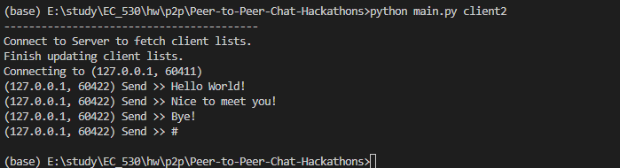

# Peer-to-Peer-Chat-Hackathons

## Summary
* A P2P chat program
* Client obtain client list from server
* Client connects to other clients to send and receive messages

## Requirement
* Python 3.6, 3.7, 3.8, 3.9
* SQLite3

## Module
### [Server](./server.py)
* Receive requests from clients
* Update the client list in database
* Send client list to connected client

### [Client](./client.py)
* Connect to server to obtain client list and store in local database
* Connect to other clients to send and receive messages

## Example
Sample use in [main](./main.py).  
Use three command lines to run in the sequence of server, client 1, client 2. 
* In the first command line window, run `python main.py server`
* In the second command line window, run `python main.py client1`
* In the third command line window, run `python main.py client2`
* Then follow the output instructions to use the program. 

## Result
### Server

### Client 1

### Client 2

